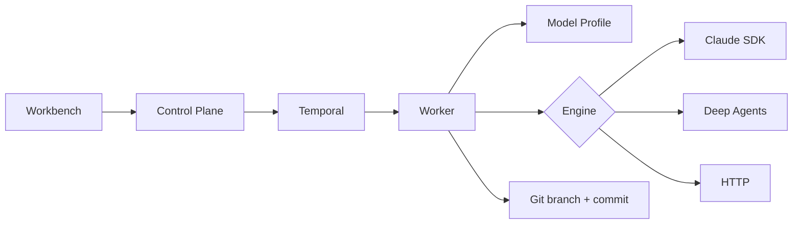

# Asterism

Asterism 是一个以 Temporal 为生命周期权威、支持多执行内核和多 Agent 顺序 handoff 的开源 AI 代码开发工作台。

> Asterism is an open-source AI coding workbench with a Temporal-controlled lifecycle, pluggable execution engines, and artifact-based multi-agent handoff.



## Quickstart

要求 Docker Compose、Java 21/Maven 3.9（开发测试）、Python 3.12 和 Node.js 20。

```bash
cp .env.example .env
# 编辑 .env：至少设置随机 V5_WORKER_CALLBACK_TOKEN 和 V5_DB_PASSWORD
make prod-up
make doctor
```

打开 `http://127.0.0.1:8080`。若未设置初始密码，从 control-plane 首次启动日志读取随机 admin 密码；登录后立即修改。

## 配置模型

1. 在“系统配置”创建系统并设置仓库、允许路径和测试命令。
2. 在“Agent / 模型配置”的模型 Tab 创建 Model Profile；API Key 只写入，页面只显示 `apiKeySet`。
3. 在同一页面的 Agent Tab 创建 Agent Role，选择 `claude_sdk`、`deepagents`、`http` 或 `fake`，绑定 Profile 和 path scope。
4. 设置默认角色。Planner 可生成有序 assignments，多角色阶段以 `AgentStageCompleted` 展示。

旧 `businessModels` 和单模型 JSON 由 Flyway 一次性迁入 Model Profile，运行期不再维护第二套模型池。

## 文档

- [架构与三层配置](docs/architecture.md)
- [事件契约](docs/event-contract.md)
- [部署与故障处理](docs/operations.md)
- [路线图](docs/roadmap.md)
- [贡献指南](CONTRIBUTING.md)

## License

Apache License 2.0，见 [LICENSE](LICENSE)。
