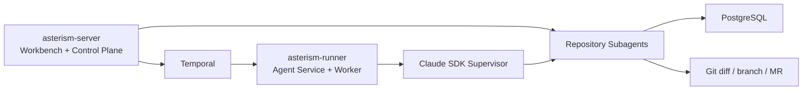

# Asterism

Asterism 是一个以 Temporal 为生命周期权威、以版本化 Artifact 为跨阶段事实来源、以 Claude SDK Supervisor 为代码执行内核的开源 AI 代码开发工作台。

> Asterism is an open-source AI coding workbench with a Temporal-controlled lifecycle, versioned artifact handoffs, and a Claude SDK supervisor for repository-scoped execution.



## Quickstart

普通部署只需要 Docker Compose，macOS 也可以使用 Apple Container。Java、Maven、Python 和 Node.js 只用于源码开发，不是安装依赖。

```bash
./asterism install
```

安装器会检测容器运行时、生成受保护的随机密钥、拉取固定版本镜像、启动并完成基础健康检查，最后打印 `http://127.0.0.1:8080` 和首次管理员密码。

如果当前检出的是尚未发布的开发分支，请使用下面的 `--build` 模式；正式 Release 只有在 CI 匿名拉取双架构镜像验证通过后才视为可安装。

从源码构建四服务栈：

```bash
V5_CONTAINER_RUNTIME=apple ./asterism install --build  # macOS Apple Container
# 或
V5_CONTAINER_RUNTIME=docker ./asterism install --build
```

日常运维统一使用：

```bash
./asterism up
./asterism status
./asterism doctor
./asterism logs server
./asterism upgrade
./asterism backup
```

部署固定为四个业务容器：`server`、`runner`、`postgres`、`temporal`。只有 `8080` 是用户入口；Runner 的 `8090` 不发布到宿主机。

## 配置模型

1. 在“系统配置”创建系统，按仓库设置路径门禁和测试命令。
2. 在“Agent / 模型配置”创建 Model Profile；API Key 只写入，页面只显示 `apiKeySet`。
3. 为 `product` 选择 PRD 对话模型，为 `developer` 选择代码模型。
4. `developer` 使用 `claude_sdk_team`。Claude SDK 会为每个仓库自动生成受权限约束的子 Agent，无需手工创建 frontend/backend Agent。
5. 在“Agent”页设置最大修订轮次（默认 5），新建工作项会冻结当时的设置。

生产代码只支持 `claude_sdk_team`；`fake` 实现保留为 `ExecutionProvider` 协议的测试基线。

## Artifact 驱动工作链

PRD 确认后形成 Approved ProductArtifact，计划审批后形成 Approved PlanningArtifact，验证通过后形成 Approved CodingArtifact：

```text
ProductArtifact
        ↓
PlanningArtifact
        ↓
CodingArtifact
```

Artifact Content 创建后不可覆盖。打回、验证失败后的修订、完整重做和 MR 审查修订都会创建新版本；`parentArtifactId` 记录跨阶段来源，`supersedesArtifactId` 记录同类型替代。Temporal 仍是工作项生命周期权威，不新增 Artifact 专用工作项状态。

Session 只负责单阶段加速。Planning 不读取 Product 对话 Transcript，Coding 不读取 Product/Planning Transcript；Session 丢失时分别从 Approved ProductArtifact 或 Approved PlanningArtifact 重建。工作项详情的“产物链”可查看各版本状态、来源、审批/打回人和替代关系。

## Project Memory

项目记忆不再从工作项终态、完整聊天或 Agent 原始输出直接生成，而是由 Artifact 生命周期驱动：

```text
Approved / Completed Artifact
            ↓
      Memory Extractor
            ↓
   Memory Candidate（待确认）
            ↓
      Project Memory
```

- ProductArtifact 产生业务 `FACT`；PlanningArtifact 产生 `DECISION / CONSTRAINT`；验证通过的 CodingArtifact 产生 `EXPERIENCE`；验证失败证据产生需补全根因和解决方式的问题经验候选。
- 候选经人工确认后才成为 `ACTIVE` Memory。被新 Artifact 版本替代时不删除，自动标记为 `OUTDATED`；人工停止使用时标记为 `ARCHIVED`。
- 每条正式 Memory 都保存 `artifactSourceId`、项目范围、置信度、适用范围和有效期，可追溯到 Product / Planning / Coding Artifact 的准确版本。
- Product、Planning、Coding 按阶段过滤项目、Memory Type 和 Artifact 关系后再做语义排序。Agent 推理、Session 全量对话、临时或被否定方案、未确认讨论不会进入 Memory。

## 人工审查与自动修订

1. 提交需求并完成负责人审批，点击“生成执行计划”。
2. Supervisor 只读检查真实仓库后展示 Coding Plan；计划正确则批准并优先恢复对应 Session，偏移时填写意见打回，系统会在新 Planning Session 中重规划。
3. 计划批准后仓库 Agent 才获得各自范围内的 Edit/Write 权限；人工等待期间 Claude 进程已退出，由 Temporal 长期等待。
4. `ModificationCompleted` 后打开“代码变更”，审查完整 Diff。
5. 发现问题时填写必填修订意见，点击“打回修订”。系统会自动进入第 N 轮修订，不需要再点“开始执行”。
6. Agent 优先在上一版候选 Diff 上增量修订；候选无法恢复时自动降级为带意见的全量修订。

Claude Session 只是上下文加速项，不是工作项恢复的事实来源。Session 丢失时，系统会使用 Approved Artifact、当前仓库事实和人工意见创建新 Session 继续。
7. 审查新 Diff；通过后继续验证和发布，仍有问题可继续打回。GitLab MR 审查期间也可打回，新 commit 会更新同一 MR。

达到修订上限时，工作项以 `revision_limit_reached` 进入阻塞；负责人可取消，或选择“完整重做”并重置轮次。

## 截图反馈

业务用户手工路径：

1. 在“创建工作项”中发一句需求并粘贴或选择截图，每条消息最多三张。
2. 立即看到自己的消息和“正在分析…”占位，等待 AI 追问。
3. 在右侧草稿直接填写验收标准，无需再组织一段对话。
4. 在最新回复的页面卡片点击“是这个”或“不是”。
5. 草稿完整后点击“确认 PRD”，等待修改、验证和发布结果。

管理员首次使用也只需三步：

1. 在 Agent / 模型配置中勾选一个支持图片理解的 Model Profile。
2. 在“系统知识”中运行路由索引。
3. 审批 Worker 提取的页面、路由和接口 candidate；只有 approved 条目参与截图匹配。

## 文档

- [架构与配置](docs/architecture.md)
- [事件契约](docs/event-contract.md)
- [部署与故障处理](docs/operations.md)
- [路线图](docs/roadmap.md)
- [贡献指南](CONTRIBUTING.md)

## License

Apache License 2.0，见 [LICENSE](LICENSE)。
