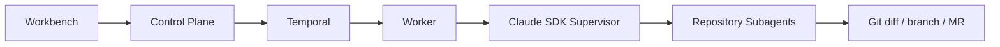

# Asterism

Asterism 是一个以 Temporal 为生命周期权威、以 Claude SDK Supervisor 为代码执行内核的开源 AI 代码开发工作台。

> Asterism is an open-source AI coding workbench with a Temporal-controlled lifecycle and a Claude SDK supervisor that delegates work to repository-scoped subagents.



## Quickstart

要求 Docker Compose、Java 21/Maven 3.9（开发编译）、Python 3.12 和 Node.js 20。

```bash
cp .env.example .env
# 编辑 .env：至少设置随机 V5_WORKER_CALLBACK_TOKEN 和 V5_DB_PASSWORD
make prod-up
make doctor
```

打开 `http://127.0.0.1:8080`。若未设置初始密码，从 control-plane 首次启动日志读取随机 admin 密码；登录后立即修改。

## 配置模型

1. 在“系统配置”创建系统，按仓库设置路径门禁和测试命令。
2. 在“Agent / 模型配置”创建 Model Profile；API Key 只写入，页面只显示 `apiKeySet`。
3. 为 `product` 选择 PRD 对话模型，为 `developer` 选择代码模型。
4. `developer` 使用 `claude_sdk_team`。Claude SDK 会为每个仓库自动生成受权限约束的子 Agent，无需手工创建 frontend/backend Agent。

生产代码只支持 `claude_sdk_team`；`fake` 实现保留为 `ExecutionProvider` 协议的测试基线。

## 截图反馈

业务用户手工路径：

1. 在“创建工作项”中发一句需求并粘贴或选择截图，每条消息最多三张。
2. 立即看到自己的消息和“正在分析…”占位，等待 AI 追问。
3. 在右侧草稿直接填写验收标准，无需再组织一段对话。
4. 在最新回复的页面卡片点击“是这个”或“不是”。
5. 草稿完整后点击“确认 PRD”，等待修改、验证和发布结果。

管理员首次使用也只需三步：

1. 在 Agent / 模型配置中勾选一个支持图片理解的 Model Profile。
2. 在“系统知识”中运行路由索引。
3. 审批 Worker 提取的页面、路由和接口 candidate；只有 approved 条目参与截图匹配。

## 文档

- [架构与配置](docs/architecture.md)
- [事件契约](docs/event-contract.md)
- [部署与故障处理](docs/operations.md)
- [路线图](docs/roadmap.md)
- [贡献指南](CONTRIBUTING.md)

## License

Apache License 2.0，见 [LICENSE](LICENSE)。
