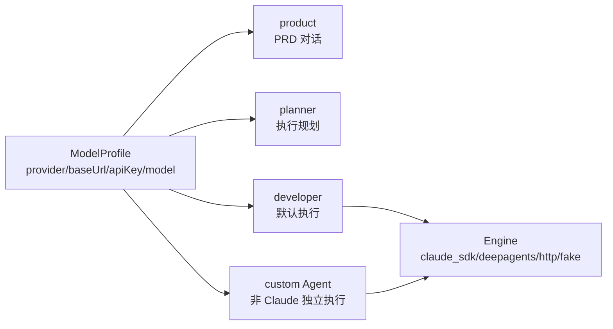
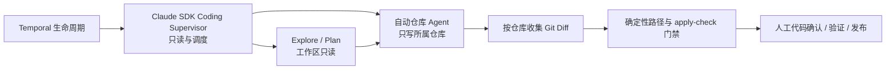
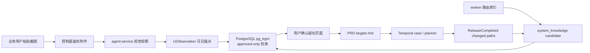

# 架构

## 兼容标识

Java 包、Python 模块、CLI 和容器均使用 Asterism 命名。PostgreSQL schema `control_plane_v5` 为避免迁移生产数据继续保留；Temporal workflow type `AgentTeamV5CaseWorkflow` 为兼容已有 history 继续保留，代码类名已改为 `AsterismCaseWorkflow`。

## 两层配置模型

- **ModelProfile**：模型接入点，只描述 `name/provider/baseUrl/apiKey/model`；公开 API 只返回 `apiKeySet`。
- **Agent**：唯一的“谁使用哪个模型”入口。内置 `product/planner/developer` 不可删除；`developer` 是 Claude SDK 团队的唯一 Profile，自定义 Agent 只服务其他独立执行内核及旧 Planner。

`product` 和 `planner` 只配置 `modelProfileRef`；`developer` 另有 `engine/maxTurns/timeoutSeconds/prompt`。Claude SDK 的原生子 Agent 与 `developer` 共用同一进程级 Profile/API Key，不能各自选择 Key。自定义 Agent 仍可为 DeepAgents、HTTP 等独立执行内核配置范围和 Profile。Profile 引用为空时回落部署默认模型。

完整 Profile 只由 worker-token 保护的 internal API 返回，并且只在 activity 进程内解析。Temporal workflow/activity 入参、事件、普通日志和前端均不携带 Key。旧 routing、AgentRole 和执行策略由 Flyway 一次性迁移后删除。

新 Case 启动时把不含 API Key 的完整 `agents + modelProfiles` 固定为 `agent_config_snapshot`。Coding Supervisor 只按快照中的 `developer` 解析团队模型和预算，仓库子 Agent 由仓库快照自动生成；Activity 每次执行仍通过 internal API 实时读取 `developer` 的 Key，因此换 Key 立即生效。无快照的旧 workflow 继续走原参数回放路径。

## 执行内核

| Engine | 模型协议 | 行为 |
| --- | --- | --- |
| `claude_sdk` | Anthropic / Claude-compatible | 在隔离 workspace 多轮读写，worker 收集 git diff |
| `deepagents` | OpenAI-compatible | Deep Agents 文件后端在隔离 workspace 改码 |
| `http` | OpenAI-compatible | agent-service 单次生成 unified diff |
| `fake` | 无 | 测试基线，不用于生产工作项 |

## Coding Attempt 执行架构

新 Case 固定写入 `execution_architecture=claude_supervisor_v1`。Workflow 只在入口按架构版本分派：新路径执行
`fetch_context → run_coding_attempt → ModificationCompleted`，不再调用独立代码 Planner、仓库摘要、
`target_files` 校验或 Temporal 前后端 Stage 编排。缺少该字段的旧 Temporal history 默认使用
`legacy_planner_v1`，原 activity 命令序列保持不变。

`developer` 是 Supervisor 配置入口且必须使用 `claude_sdk`。每个仓库自动生成一个可写 SDK 原生子 Agent，
统一继承 `developer` 的模型、端点、API Key 和轮次；用户不再手工配置 frontend/backend Profile。Claude 可自主
调用 Explore、Plan 等内置 Agent 做只读探索，并按需选择仓库 Agent 完成修改。

SDK 顶层注册团队工具并集，因为该列表是所有子 Agent 的能力上限；Supervisor 的逻辑权限仍只有
`Read/Glob/Grep/Agent/TaskOutput`，未绑定仓库的内置或未知 Agent 默认只读。仓库 Agent 可以读取整个团队工作区，
但写入按 `agent_id → writableRoots/allowedPaths/forbiddenPaths` 约束。
SDK 使用同一 `AgentPolicy` 驱动 `PreToolUse` 确定性门禁与 `can_use_tool` 权限回调，避免内置后台 Agent
退回交互拒绝，也不会放宽 Edit/Write 边界；Bash 只允许执行系统预先
配置的仓库验证命令。完全相同的子任务不重复派发，后台任务必须结束后才能收集 Diff。最终 Diff 仍再次执行
路径门禁和 `git apply --check`，模型产生的 `target_files/scope_paths` 不作为权限或真实性依据。

Coding 阶段的重试以完整 Coding Attempt 为单位：刷新配置只替换 `agent_config_snapshot`，并把人工反馈和
上一版各仓完整 Diff 作为参考传回 Supervisor。由于隔离仓库每次重建，当前不跨工作区 resume SDK session；
`sessionId`、子 Agent 运行记录和 Token 只用于审计，避免把失效的临时路径当成可靠状态。

## 阶段恢复

生命周期只定义 `planning → coding → patch → validation → release` 五个固定执行阶段。失败事件写入
`failedPhase`，恢复行为由 `PHASE_RECOVERIES` 注册表声明阶段 runner 和需要恢复的 checkpoint；新增阶段只增加
注册项，不按错误原因扩展 `if/else` 链。

| 动作 | 语义 | 复用范围 |
| --- | --- | --- |
| `retry_current_phase` | 重试失败阶段 | 保留候选 Diff、上下文和已完成阶段 |
| `rework` | 完整重做 | 从 planning/coding 重新执行，旧候选只作为反馈参考 |
| `rework_with_latest_config` | 刷新配置后重试失败阶段 | 只用于 planning/coding，替换配置快照但保留执行上下文 |

Patch 恢复会复用 `ModificationCompleted`；Validation 额外恢复 `PatchApplied`；Release 再额外恢复
`ValidationPassed`。因此发布服务故障不会重新 Coding，验证服务故障也不会重复应用 Patch。当前轻量实现复用
Temporal state 中已有的 Context、Diff 和阶段结果，不新增 Artifact Store、候选 Commit 或另一套图引擎。
GitLab 克隆目录仍是 Activity 内的临时资源，不写入 Workflow history。

新 Workflow 通过 `phase-recovery-v1` patch marker 启用该语义；已启动的旧 history 继续回放冻结的 legacy
恢复路径，直到自然结束。

## Legacy Handoff

以下规则只服务 `legacy_planner_v1` 和旧 Temporal history。`ExecutionPlan.assignments[]` 包含 `role/repo/scope_paths/step_refs`。单仓可省略 `repo`，多仓必须显式指定。`scope_paths` 仅用于帮助执行 Agent 定位代码，硬路径门禁只取系统 `allowedPaths` 与 Agent `pathScope`。Planner 收到按 repo 标注的 Git tracked 摘要和剔除 Profile/Key 后的 role 元数据。

Workflow 在现有 `start_modification` 内顺序执行 assignments。每段只在所属 repo 的隔离 workspace 执行，并收到带 repo 的前序 handoff；路径门禁和冲突键均为 `(repo, path)`。不冲突的 diff 最终仍只有一个 `ModificationCompleted`，同时保留每仓 `repoDiffs`。

跨框架不共享 SDK 会话，只交接工件和 `AgentStageCompleted` 事件。阶段事件的 causation/idempotency suffix 为 `stage:<index>:<role>`，可 replay 且不会相互去重。

## Temporal 修改守则

- `local` 模式保持原生命周期；`gitlab` 模式新增 `waiting_merge`。
- 已上线 workflow 的确定性分支保持 replay 兼容；老 history 没有 assignments 时走单 Agent 路径。
- 新旧执行架构只通过 Case 输入版本在入口分派，不在 activity 内散落兼容条件。
- 对不兼容 workflow 修改使用 Temporal worker versioning / `workflow.patched`，补 replay 测试后再移除旧分支。
- `domain_events.sequence` 与 `work_items.last_applied_sequence` 的投影机制不得绕过。

## GitLab 发布边界

`releaseMode=gitlab` 时，Patch 审批后由 worker 在临时 shallow clone 中按仓验证、提交 `wi/<workItemId>`、用 `force-with-lease` 幂等推送并创建或复用 MR。Token 仅由 activity 通过 internal API 实时读取，临时 `0600` credential store 在 Git 命令结束后删除，不进入 Temporal、事件、日志、前端或 `.git/config`。

全部 MR 创建后进入 `waiting_merge`。服务器 A 上的 Temporal timer 主动调用 GitLab API 轮询 MR，因此只要求 `A → B`；不要求 GitLab B 能回调 A，也不提供 webhook 双实现。部分合并保持等待，全部合并产生 `ReleaseCompleted`，MR 被关闭则进入 `worker_blocked`。人工“标记已合并”也必须先由控制面实时核验 GitLab。

Asterism 的职责止于“所有 MR 已合并”。合并后的 CI/CD、部署和服务重启属于 GitLab Runner，当前及未来都不进入 Asterism 核心生命周期。

## 多模态截图管线

控制面负责附件鉴权、短暂转发图片字节、知识检索和确认；agent-service 是唯一调用 vision 模型的组件；worker 负责读取 repo 并通过专用 `AsterismRouteIndexWorkflow` 回写 candidate，控制面不读取源码目录。

三条铁律：

1. 图片本体不进入 Temporal payload、domain event payload 或 memory，只流转附件 ID 与派生文本。
2. 接口和代码位置依赖系统知识检索与人工确认，视觉模型只描述画面，不直接猜测实现。
3. `system_knowledge` 只有 `approved` 条目参与匹配，candidate、rejected、disabled 均不投喂。
