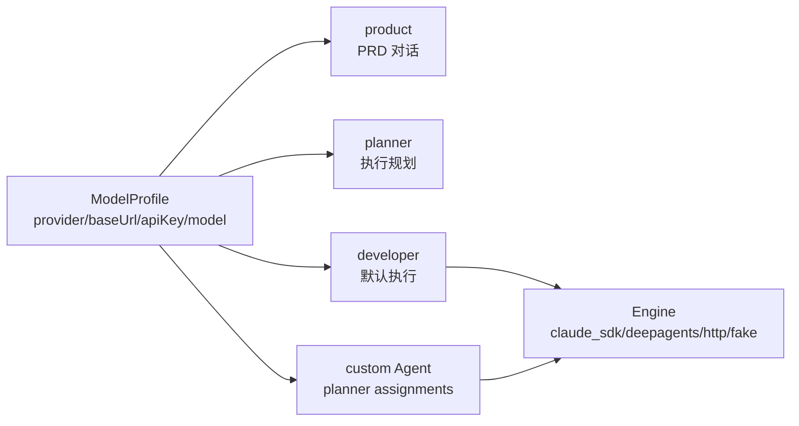
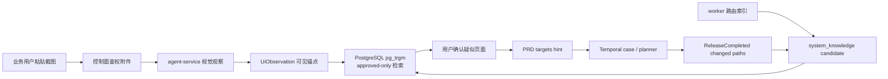

# 架构

## 兼容标识

Java 包、Python 模块、CLI 和容器均使用 Asterism 命名。PostgreSQL schema `control_plane_v5` 为避免迁移生产数据继续保留；Temporal workflow type `AgentTeamV5CaseWorkflow` 为兼容已有 history 继续保留，代码类名已改为 `AsterismCaseWorkflow`。

## 两层配置模型

- **ModelProfile**：模型接入点，只描述 `name/provider/baseUrl/apiKey/model`；公开 API 只返回 `apiKeySet`。
- **Agent**：唯一的“谁使用哪个模型”入口。内置 `product/planner/developer` 不可删除；自定义 Agent 供 Planner 按名称引用。

`product` 和 `planner` 只配置 `modelProfileRef`；`developer` 与自定义 Agent 另有 `engine/maxTurns/timeoutSeconds/pathScope/prompt`。Profile 引用为空时回落部署默认模型。`planner_select` 是固定行为，不再存在 ModelRouting、默认 Role 或 ExecutionPolicy。

完整 Profile 只由 worker-token 保护的 internal API 返回，并且只在 activity 进程内解析。Temporal workflow/activity 入参、事件、普通日志和前端均不携带 Key。旧 routing、AgentRole 和执行策略由 Flyway 一次性迁移后删除。

新 Case 启动时把不含 API Key 的完整 `agents + modelProfiles` 固定为 `agent_config_snapshot`：`engine/maxTurns/timeoutSeconds/pathScope/prompt` 以及模型参数均以启动时快照为准，在途工作项不受后续配置修改影响。Activity 每次执行仍按快照中的 `modelProfileRef` 通过 internal API 实时读取 Key，因此换 Key 立即生效；无快照的旧 workflow 继续走原参数回放路径。

## 执行内核

| Engine | 模型协议 | 行为 |
| --- | --- | --- |
| `claude_sdk` | Anthropic / Claude-compatible | 在隔离 workspace 多轮读写，worker 收集 git diff |
| `deepagents` | OpenAI-compatible | Deep Agents 文件后端在隔离 workspace 改码 |
| `http` | OpenAI-compatible | agent-service 单次生成 unified diff |
| `fake` | 无 | 测试基线，不用于生产工作项 |

## Handoff

`ExecutionPlan.assignments[]` 包含 `role/repo/scope_paths/step_refs`。单仓可省略 `repo`，多仓必须显式指定。Planner 收到按 repo 标注的摘要和剔除 Profile/Key 后的 role 元数据。

Workflow 在现有 `start_modification` 内顺序执行 assignments。每段只在所属 repo 的隔离 workspace 执行，并收到带 repo 的前序 handoff；路径门禁和冲突键均为 `(repo, path)`。不冲突的 diff 最终仍只有一个 `ModificationCompleted`，同时保留每仓 `repoDiffs`。

跨框架不共享 SDK 会话，只交接工件和 `AgentStageCompleted` 事件。阶段事件的 causation/idempotency suffix 为 `stage:<index>:<role>`，可 replay 且不会相互去重。

## Temporal 修改守则

- `local` 模式保持原生命周期；`gitlab` 模式新增 `waiting_merge`。
- 已上线 workflow 的确定性分支保持 replay 兼容；老 history 没有 assignments 时走单 Agent 路径。
- 对不兼容 workflow 修改使用 Temporal worker versioning / `workflow.patched`，补 replay 测试后再移除旧分支。
- `domain_events.sequence` 与 `work_items.last_applied_sequence` 的投影机制不得绕过。

## GitLab 发布边界

`releaseMode=gitlab` 时，Patch 审批后由 worker 在临时 shallow clone 中按仓验证、提交 `wi/<workItemId>`、用 `force-with-lease` 幂等推送并创建或复用 MR。Token 仅由 activity 通过 internal API 实时读取，临时 `0600` credential store 在 Git 命令结束后删除，不进入 Temporal、事件、日志、前端或 `.git/config`。

全部 MR 创建后进入 `waiting_merge`。服务器 A 上的 Temporal timer 主动调用 GitLab API 轮询 MR，因此只要求 `A → B`；不要求 GitLab B 能回调 A，也不提供 webhook 双实现。部分合并保持等待，全部合并产生 `ReleaseCompleted`，MR 被关闭则进入 `worker_blocked`。人工“标记已合并”也必须先由控制面实时核验 GitLab。

Asterism 的职责止于“所有 MR 已合并”。合并后的 CI/CD、部署和服务重启属于 GitLab Runner，当前及未来都不进入 Asterism 核心生命周期。

## 多模态截图管线

控制面负责附件鉴权、短暂转发图片字节、知识检索和确认；agent-service 是唯一调用 vision 模型的组件；worker 负责读取 repo 并通过专用 `AsterismRouteIndexWorkflow` 回写 candidate，控制面不读取源码目录。

三条铁律：

1. 图片本体不进入 Temporal payload、domain event payload 或 memory，只流转附件 ID 与派生文本。
2. 接口和代码位置依赖系统知识检索与人工确认，视觉模型只描述画面，不直接猜测实现。
3. `system_knowledge` 只有 `approved` 条目参与匹配，candidate、rejected、disabled 均不投喂。
