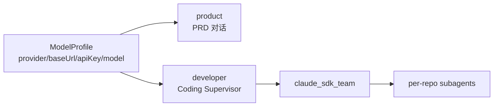
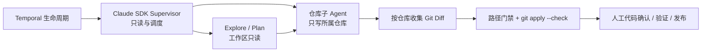
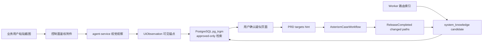

# 架构

## 当前版本边界

生命周期只注册一个 Temporal workflow type：`AsterismCaseWorkflow`。仓库不保留 V5/V6 Workflow 类、旧 Planner 执行链或 replay 分支。`/api/v5` 与 PostgreSQL schema `control_plane_v5` 是现有接口和存储命名，不代表存在多套 Workflow 实现。

当前系统尚未上线，升级时直接清理测试 Case 与 Temporal history 后重建，不提供旧 Workflow 恢复入口。正式上线后，任何 replay 可见的修改都必须先建立 Worker Versioning 或 `workflow.patched` 迁移方案。

## 两层配置模型

- **ModelProfile**：模型接入点，只描述 `name/provider/baseUrl/apiKey/model`；公开 API 只返回 `apiKeySet`。
- **Agent**：只保留内置 `product` 与 `developer`。`product` 负责需求对话；`developer` 负责一个完整 Coding Attempt。
- **Repository**：仓库配置持有真实的 `allowedPaths`、`forbiddenPaths` 和验证命令，是子 Agent 权限的唯一业务来源。

完整 Profile 只由 Worker Token 保护的 internal API 返回，并且只在 Activity 进程内解析。Temporal 入参、事件、普通日志和前端均不携带 API Key。Case 启动时固定不含 Key 的 `agents + modelProfiles` 快照；Activity 每次执行实时读取所选 Profile 的 Key，因此换 Key 不需要重建 Case。

## 执行内核与扩展点

| Engine | 用途 | 行为 |
| --- | --- | --- |
| `claude_sdk_team` | 生产代码执行 | 一个 Claude SDK Supervisor 调度按仓库隔离的原生子 Agent |
| `fake` | 测试基线 | 返回确定性结果，不允许用于业务工作项 |

Worker 内部保留 `ExecutionProvider` 协议作为开源扩展点。新执行内核应实现统一的 `CodingAttemptRequest → CodingAttemptResult` 协议并在 factory 注册；生命周期 Workflow 不感知厂商协议，也不为新 Provider 增加一套 Planner 或状态机。

## Coding Attempt

Workflow 固定执行 `fetch_context → run_coding_attempt → ModificationCompleted`，不生成独立执行计划，不让模型提供 `target_files/scope_paths` 作为权限依据。每个仓库自动生成一个可写 SDK 原生子 Agent，统一继承 `developer` 的模型、端点、API Key 和执行预算。

SDK 顶层工具列表是所有子 Agent 的能力上限。Supervisor 只有 `Read/Glob/Grep/Agent/TaskOutput`；未绑定仓库的内置 Agent 默认只读；仓库 Agent 可读取团队工作区，但 Edit/Write 按 `agent_id → repo/allowedPaths/forbiddenPaths` 硬约束。Bash 只允许系统预配置的仓库验证命令。

Provider 完成后，Worker 再按仓库收集 Git Diff、执行路径门禁和 `git apply --check`。模型输出、工具调用结果或被 Git 忽略的路径都不能放宽门禁。

## 阶段恢复

生命周期按 `coding → patch → validation → release` 恢复。失败事件记录 `failedPhase`，恢复 runner 与 checkpoint 由注册表声明；新增阶段通过增加策略扩展，不按错误原因堆叠条件分支。

Workflow 按职责拆分为四个模块：`lifecycle.py` 只保留 signal、query、主循环与 `ActionSpec` 动作分发；`coding.py` 管理 Coding Attempt 与候选上下文；`publishing.py` 管理 Patch、MR 和 Release；`validation.py` 管理验证与回滚。只有 `lifecycle.py` 注册 Temporal Workflow type，其余模块不引入第二套状态机。

| 动作 | 语义 | 复用范围 |
| --- | --- | --- |
| `retry_current_phase` | 重试失败阶段 | 保留上下文、候选 Diff 与已完成阶段 |
| `rework` | 完整重做 | 从 Coding Attempt 重新执行，旧候选作为反馈上下文 |
| `rework_with_latest_config` | 刷新配置后重试 Coding | 替换 Agent 配置快照，保留候选与上下文 |

Patch 恢复会复用 `ModificationCompleted`；Validation 额外恢复 `PatchApplied`；Release 再额外恢复 `ValidationPassed`。GitLab 临时 clone 目录属于 Activity 资源，不写入 Workflow history。

## Temporal 修改守则

- `local` 模式保持本地分支发布；`gitlab` 模式增加 `waiting_merge`。
- `domain_events.sequence` 与 `work_items.last_applied_sequence` 的投影机制不得绕过。
- Workflow 只编排确定性状态和 Activity 调用；网络、文件系统、Git 与模型调用只能在 Activity 内执行。
- 正式上线后，对 replay 不兼容的修改使用 Worker Versioning / `workflow.patched` 并补 replay 测试。

## GitLab 发布边界

`releaseMode=gitlab` 时，Patch 审批后由 Worker 在临时 shallow clone 中按仓验证、提交 `wi/<workItemId>`、用 `force-with-lease` 幂等推送并创建或复用 MR。Token 仅由 Activity 通过 internal API 实时读取，临时 `0600` credential store 在 Git 命令结束后删除，不进入 Temporal、事件、日志、前端或 `.git/config`。

全部 MR 创建后进入 `waiting_merge`。Temporal timer 主动调用 GitLab API：部分合并继续等待，全部合并产生 `ReleaseCompleted`，MR 被关闭则进入 `worker_blocked`。合并后的 CI/CD、部署和服务重启属于 GitLab Runner，不进入 Asterism 生命周期。

## 多模态截图管线

控制面负责附件鉴权、短暂转发图片字节、知识检索和确认；agent-service 是唯一调用视觉模型的组件；Worker 读取 repo 并通过 `AsterismRouteIndexWorkflow` 回写 candidate，控制面不读取源码目录。

三条铁律：

1. 图片本体不进入 Temporal payload、domain event payload 或 memory，只流转附件 ID 与派生文本。
2. 接口和代码位置依赖系统知识检索与人工确认，视觉模型只描述画面，不直接猜测实现。
3. `system_knowledge` 只有 `approved` 条目参与匹配，candidate、rejected、disabled 均不投喂。
